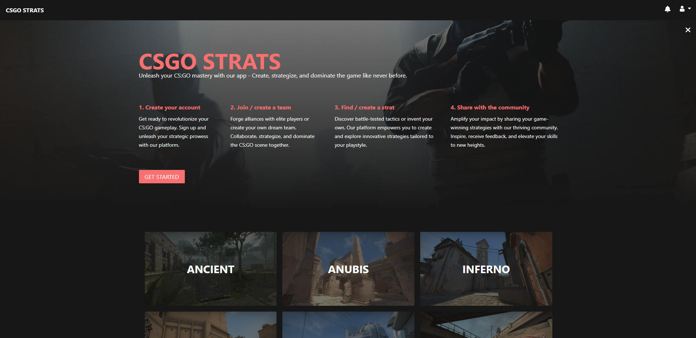

# Csgo Nade App

<p style="text-align: center">
An application for teams and users the create and share csgo strategies
</p>

<a href="https://beta.csgostrats.com/" target="_blank">
  
</a>

## About

_The current state of the application is hosted at: <a href="https://beta.csgostrats.com/" target="_blank">https://beta.csgostrats.com/</a>_

The concept revolves around players developing strategies using various nade sets. These strategies can be shared either publicly with the community or privately within a specific team. When viewing a strategy, the map's radar is shown, indicating all the nades thrown as part of the strategy. By clicking on the nade, users can see images of lineups and landing points of each grenade. Additionaly, strategies can include descriptions describing what actions each player should execute.

## Contribution

**Default flow:** Fork the repo, create a new branch from dev, develop the changes, send a pull request to dev branch in this repo.

To get local environment up and running follow the steps mentioned in "Getting started" belov.

## Getting started

### Prerequisite

- Node: 18.13.0
- Docker
- Supabase CLI

### Steps

1. Clone repo

2. Start local supabase server (make sure docker dameon is running)

```
npx supabase start
```

4. Add env file, _see .env.example for list of all variables needed_
5. Install dependencies

```
npm install
```

6. Run application

```
npm run dev
```

## Supabase cheatsheet

**Login to supabase CLI**

```
npx supabase login
```

**Start local supabase**

```
npx supabase start
```

**Stop local supabase**

```
npx supabase stop
```

**Create new migration**

```
npx supabase migration new [migration_name]
```

**Create migartion based on diff after editing from browser**

```
npx supabase db diff --use-migra -f [migration_name]
```

**Reset local db**

```
npx supabase db reset
```

**Updating typescript types**

```
npx supabase gen types typescript --local > ./src/schema.ts
```

**Link to remote project**

```
npx supabase link --project-ref [project-id]
```

**Capture any changes made to remote database**

```
npx supabase db remote commit

# If you have not made any changes to the remote database, skip this step
```

**Deploy changes**

```
npx supabase db push
```
